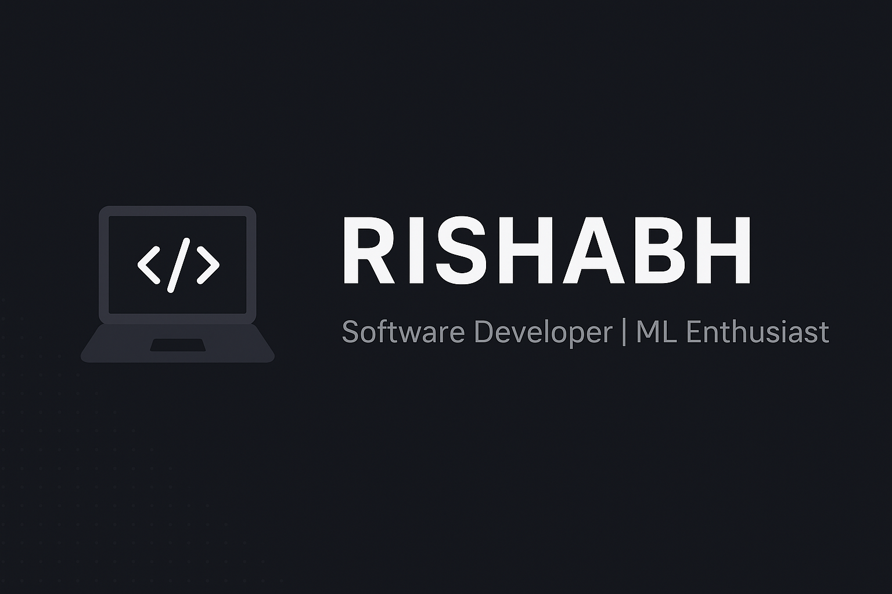

  

# 👋 Hi, I'm Rishabh Patel  

## 🚀 About Me  
🎓 Computer Science Graduate | 💻 Software Developer | 🤖 ML Enthusiast  

- 🌱 Skilled in **Java, Python, MySQL, Machine Learning**  
- ⚡ Experience in **automation, APIs, GUI development, social media automation**  
- 🎯 Passionate about building **real-world applications & data-driven solutions**  
- 📫 Reach me at **[rishabhpatel366@gmail.com](mailto:rishabhpatel366@gmail.com)**  

---

## 🛠️ Tech Stack  

**Languages & Frameworks:**  

**Databases & Tools:**  

**Libraries & ML:**  

---

## 📂 Featured Projects  

🔹 [**Student Performance Prediction (ML)**]  
> Built a model to predict student performance with ~80% accuracy using Python and Scikit-learn.  

🔹 [**Restaurant Management System (Java, MySQL, Swing)**](https://github.com/RishabhPatel123/Swing-Project)  
> GUI-based system to automate restaurant orders and billing.  

🔹 [**Portfolio Website**](https://rishabhverse.free.nf/)  
> Personal portfolio showcasing projects, built with HTML, CSS, and JS.  

🔹 [**Social Media Automation**](https://github.com/RishabhPatel123/Twitter-Automation)  
> Automated posting & data collection on Twitter, YouTube, and Facebook using Python + APIs.  

---

## 📊 GitHub Stats  

  
  

---

## 🌐 Connect with Me  

  
  
  

